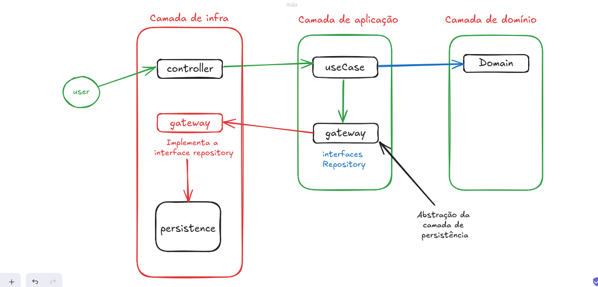

# CodeChella

App de simulação de um site para venda de ingressos de eventos diversos

## 🔨 Objetivos do projeto

- Conhecer os diferentes tipos de arquitetura de software;
- Aprender os princípios da Clean Architecture;
- Implementar um projeto com separação de responsabilidades e isolamento do domínio;
- Entender sobre entidades, objetos de valor, casos de uso, repositórios e controladores;
- Analisar os prós e contras de arquiteturas que utilizam muitas camadas de abstração.

# Qual a diferença de uma entity para um value object?

No contexto da clean architecture, as entidades e objetos de valor são conceitos fundamentais que ajudam a modelar o
domínio da aplicação de forma coesa e semântica. Eles desempenham papéis distintos na representação dos conceitos do
domínio e na estruturação do código.

As entidades (entities) representam os objetos principais do domínio da aplicação. Elas têm identidade própria e são
mutáveis, o que significa que as mudanças em seus atributos refletem mudanças no estado do sistema. As entidades são
geralmente associadas a conceitos do domínio que têm vida útil longa e são distinguidos por suas características únicas.

Por exemplo, em um sistema de gerenciamento de biblioteca, um livro pode ser considerado uma entidade. Ele tem um ISBN (
Número Padrão Internacional de Livro) que é único e permite que você identifique esse livro específico, não importa se o
título ou o autor mudarem. As entidades encapsulam a lógica de negócios relacionada a si mesmas e são o cerne do modelo
de domínio.

Os objetos de valor (value objects) representam valores que são importantes para o domínio da aplicação, mas não têm
identidade própria. Eles são imutáveis, ou seja, uma vez criados, seus valores não podem ser alterados. Os objetos de
valor são geralmente usados para modelar conceitos do domínio que são definidos exclusivamente por seus atributos, sem
identidade distinta.

Por exemplo, um objeto de valor comum poderia ser "Endereço", que incluiria atributos como rua, cidade, estado, CEP etc.
Cada instância de "Endereço" é distinta apenas pelos seus atributos e pode ser comparada com outras instâncias baseadas
nesses valores.

A distinção entre entidades e objetos de valor é importante na clean architecture porque ajuda a definir limites claros
entre conceitos de domínio e detalhes de implementação. As entidades encapsulam a lógica de negócios central da
aplicação e representam conceitos que têm identidade própria e ciclo de vida longo. Por outro lado, os objetos de valor
representam valores que são importantes para o domínio, mas não têm identidade própria e são usados principalmente para
definir tipos imutáveis e semânticos.

Ao projetar sistemas usando a clean architecture, é importante identificar e modelar adequadamente as entidades e
objetos de valor relevantes para o domínio da aplicação, garantindo que o código seja coeso, compreensível e fácil de
manter.

## Caso de uso (use case) o que é?

Dentro da arquitetura limpa (clean architecture), os casos de uso são definidos na camada de regras de negócio (ou use
cases) da arquitetura. Essa camada é responsável por conter a lógica de negócios da aplicação, onde são implementadas as
funcionalidades específicas do sistema.

Para definir bem os casos de uso dentro da arquitetura limpa, você pode seguir estas práticas:

1. Identificar os requisitos do sistema: antes de tudo, é fundamental entender os requisitos do sistema e as
   necessidades dos usuários. Isso ajudará a determinar quais casos de uso precisam ser implementados.
2. Definir os casos de uso: com base nos requisitos identificados, você pode definir os casos de uso da aplicação. Cada
   caso de uso deve representar uma funcionalidade ou um conjunto de funcionalidades específicas que o sistema oferece
   aos usuários.
3. Nomear os casos de uso de forma clara e concisa: os nomes dos casos de uso devem ser descritivos e indicativos do que
   a funcionalidade faz. Isso facilitará a compreensão e a comunicação entre os membros da equipe.
4. Identificar os atores envolvidos: para cada caso de uso, identifique os atores (usuários, sistemas externos etc.) que
   interagem com o sistema e quais são suas responsabilidades dentro do contexto da funcionalidade.
5. Descrever os fluxos de eventos: para cada caso de uso, descreva os fluxos de eventos que representam as diferentes
   interações entre os atores e o sistema. Isso inclui os passos necessários para completar a funcionalidade, bem como
   os possíveis cenários de exceção.
6. Implementar os casos de uso na camada de regras de negócio: após definir os casos de uso, você pode implementá-los na
   camada de regras de negócio da arquitetura limpa. Cada caso de uso deve ser uma classe ou um componente que encapsula
   a lógica de negócios correspondente.
7. Testar os casos de uso de forma isolada: certifique-se de testar cada caso de uso de forma isolada para garantir que
   eles funcionem conforme o esperado. Isso pode ser feito utilizando testes unitários e testes de integração.
8. 

## Gateways o que é?

São os pontos de entradas , onde se define como será posteriormente a persistência de dados

## Passo a passo de como implementar a arquitetura lima

1. criar um `use case` que utilize elementos da camada de dominio
2. Injetar uma interface (gateway) no `use case`

## Diagrama de fluxo de arquitetura limpa

